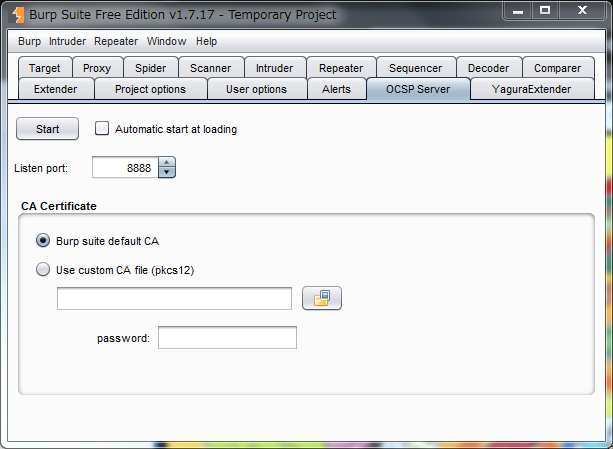

Burp suite 証明書変更ツール
=============
Language/[English](Readme.md)

このツールは、PortSwigger社の製品であるBurp Suiteが動的に生成する証明書の変更や含まれていない情報を追加するためのツールです。

本ツールには２つのプロジェクトが含まれています。

FakeBurpCert
_____________

Burp suite の作成する証明書に変更を加えます。
現時点において以下のいずれかのことが可能です。

1. CNの変更
2. SerialNumberの指定
3. 証明書の有効期限の指定
4. SAN(Subject Alternative Name)の変更もしくは追加
5. OCSP URI の追加

SimpleOCSPServer
_____________

簡易 OCSP レスポンダ サーバです。

# 使用方法

## FakeBurpCert

以下のファイルをBurpのjarファイルがあるフォルダにおきます。

* FakeBurpCert.jar
* cert.txt
* javassist.jar

Burp suiteのjarファイルがあるフォルダに移動し、(-jar オプションより前に) -javaagentコマンドラインオプションを指定して起動します。

```
java -javaagent:FakeBurpCert.jar -Xmx1024m -jar burpsuite_free_v1.7.06.jar
```

## cert.txt ファイルの変更

cert.txt には 証明書を変更するためのルールを記載します。

このファイルは以下の形式にて記載します。
なお、文字コードはUTF-8で記載する必要があります。

```
# 行頭が#はコメント扱い
CN=www\.example\.com(,$)	x509.info.subject	CN=www.example.jp, OU=piyo CA, O=fuga, C=hoge
CN=www\.example\.com(,$)	x509.info.serialNumber	11223344AABB
CN=www\.example\.com(,$)	x509.info.validity	yyyy/MM/dd	2017/01/01	2027/12/31
CN=www\.example\.com(,$)	x509.info.extensions.SubjectAlternativeName	www.example.com
CN=www\.example\.com(,$)	x509.info.extensions.AuthorityInfoAccess.ocsp	http://www.example.com:8888/
```
ルールは複数行記載することが可能です。

各項目はタブ区切りとなっておりそれぞれ以下の値を設定します。

１カラム目 : 変更を加えたい証明書のsubjectにマッチする正規表現を記載、マッチした場合に処理が行われます。

２カラム目 : 追加もしくは更新するフィールドの種類を記載

３カラム目 : 追加もしくは更新する値

２カラム目に指定できるフィールドの種類は以下になります。

* x509.info.subject
    * 証明書のsubject ... 変更後のSubjectを記載。CNについても変更可能です。

* x509.info.serialNumber
    * 証明書のserialNumber ... 16進数で記載します。

* x509.info.validity
    * 証明書の有効期限 ... [dateFormatPattern] [fromDate] [toDate]の順で記載。各項目はタブ区切りです。
         * dateFormatPattern ... SimpleDateFormatにて利用可能な日付フォーマットを指定可能です。
         * fromDate ... 開始日(日付フォーマットの書式にて記載)
         * toDate ... 終了日(日付フォーマットの書式にて記載)

* x509.info.extensions.SubjectAlternativeName
    * 証明書のSAN ... 追加するSANを記載します。既存のSANの変更や削除はされずに指定したSANの追加となります。

* x509.info.extensions.SubjectAlternativeName.clear
    * 既存のSANをクリアします。値が指定されてない場合は、SANが指定されていない証明書となり、
      値が指定された場合は、既存のSANをクリアした後に指定された値が追加されます。

* x509.info.extensions.AuthorityInfoAccess.ocsp
    * 証明書のOCSP URI ... URI を記載

ちなみにBurp suiteが動的に生成する証明書のsubjectは以下のような形式になってます。

```
CN=www.example.jp, OU=PortSwigger CA, O=PortSwigger, C=PortSwigger
```

Burp suiteのバージョンv2020.2からは、証明書のライブラリにBouncy Castleが利用されるようになっており以下の形式となっております。

```
C=PortSwigger,O=PortSwigger,OU=PortSwigger CA,CN=www.example.com
```

証明書のOCSP URI を記載した場合はクライアントアプリから検証処理のリクエストが発生する場合があります。
このOCSPの検証処理に対応するために簡易 OCSP レスポンダ サーバ(SimpleOCSPServer)を用意しています。

## SimpleOCSPServer

簡易 OCSP レスポンダサーバを起動します。

以下のコマンドで起動できます。 

```
java -jar SimpleOCSPServer.jar -cafile=burp_ca.p12 -password=testca -port=8888
```

証明書が複数格納されてる場合は、aliasで証明書を指定できます。

```
java -jar SimpleOCSPServer.jar -cafile=burp_ca.p12 -alias=cacert -password=testca -port=8888
```

* -cafile
    * 秘密鍵を含むCA証明書(PKCS12形式)
* -password
    * CA証明書のパスワード
* -alias 
    * 証明書のエイリアスを指定します。省略可能です。省略時は最初に見つかった証明書になります。
* -port
    * 待ち受けポートになります。省略可能です。省略時は8888になります。

Burp suite のCAは以下の手順でExportできます。
 
1. [Options]タブの[CA Certificate]をクリック
2. Exportの[Certificate and private key in PKCS#12 keystore]を選択して次へ
3. ファイル名とパスワードを指定して次へ指定してエクスポート

SimpleOCSPServer は BurpExtender にも対応しています。

 

* [Start] ボタン
    * OCSP Server を起動します。もう一度クリックすると停止します。
* Automatic start at loading 
    * チェック時、Burp suite 起動時に自動で OCSP Server を起動します。
* Listen port
    * OCSP Server の待ち受けポートになります。
* CA Certificate
    * Burp suite default CA 
        * Burp suite がデフォルトで利用している CA を利用します。
    * Use custom CA file
        * 秘密鍵を含む CA 証明書(PKCS12形式)を指定します。

Burp suite の Extenderは以下の手順で読み込めます。

1. [Extender]タブの[add]をクリック
2. [Select file ...]をクリックし、SimpleOCSPServer.jar を選択する。
3. ｢Next｣をクリックし、エラーがでてないことを確認後、「Close」にてダイヤログを閉じる。

# 動作環境

## Burp suite
* v1.7以上 (http://www.portswigger.net/burp/)
* v2020.2 (最終確認バージョン)

## 開発環境
* NetBeans 12.2 (https://netbeans.apache.org/)

## ビルド
NetBeans にてビルドもしくは gradle にてビルドします。


```
gradlew release
```

## 必須ライブラリ
ビルドには別途 [BurpExtensionCommons](https://github.com/raise-isayan/BurpExtensionCommons) のライブラリを必要とします。
* BurpExtensionCommons v0.4.1.0

## 利用ライブラリ
* Jassist 3.26.0 (https://www.javassist.org/)
  * Mozilla Public License Version 1.1, GNU Lesser General Public License Version 2.1, Apache License Version 2.0
  * https://github.com/jboss-javassist/javassist

* Google gson (https://github.com/google/gson)
  * Apache License 2.0
  * https://github.com/google/gson/blob/master/LICENSE

* Universal Chardet for java (https://code.google.com/archive/p/juniversalchardet/)
  * MPL 1.1
  * https://code.google.com/archive/p/juniversalchardet/

* BouncyCastle 1.6.1 (http://bouncycastle.org/)
  * MIT license
  * https://www.bouncycastle.org/license.html

* Jetty 9 (https://www.eclipse.org/jetty/)
  * Apache License 2.0, Eclipse Public License 1.0
  * https://www.eclipse.org/jetty/licenses.html

* Use Icon (http://www.famfamfam.com/lab/icons/silk/)
  * Creative Commons Attribution 2.5 License
  * http://www.famfamfam.com/lab/icons/silk/

## 注意点
このツールは、私個人が勝手に開発したもので、PortSwigger社は一切関係ありません。本ツールを使用したことによる不具合等についてPortSwiggerに問い合わせないようお願いします。
このツールは内部でJava実行環境のバイトコードを変更します。Oracle社のJava実行環境で使用した場合、[バイナリ・コードライセンス](http://www.oracle.com/technetwork/java/javase/terms/license/index.html)に違反する可能性があります。ライセンスを確認の上、[OpenJDK](http://openjdk.java.net/)等その他のJava実行環境での実行を推奨します。

## 謝辞
このツールのアイデアのベースとなったツールに[Belle (Burp Suite 非公式日本語化ツール) ](https://github.com/ankokuty/Belle) があり影響を受けています。
Belleの作者には本ツール作成にあたりアドバイスをいただきました。この場を借りてお礼を申し上げます。

